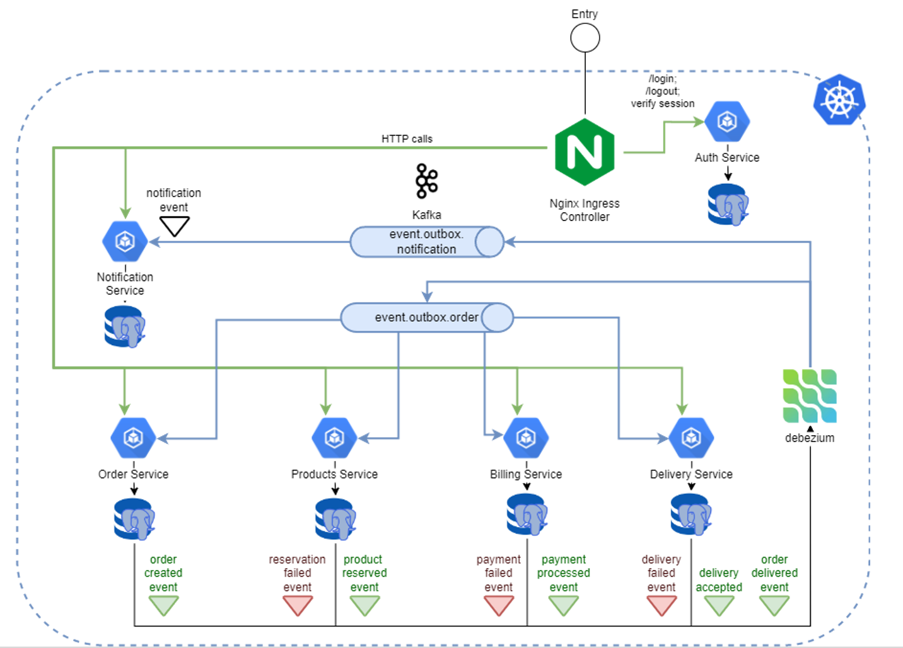

# Онлайн магазин на микросервисной архитектуре

Данный проект представляет из себя онлайн магазин с 6-ю микросервисами, запускается в kubernetes из helm чарта,
микросервисы включают в себя:
- auth-service
- billing-service
- order-service
- product-service
- notification-service
- delivery-service

В центре проекта стоит реализация паттерна SAGA по типу хореографии:
1) клиент заполняет адрес доставки и желаемую дату доставки, нажимает кнопку «Оформить заказ»
2) заказ переходит в статус «Оформлен»
3) товар резервируется на складе
4) происходит оплата заказа со счета клиента
5) заказ отправляется в службу доставки, происходит назначение курьера
6) курьер доставляет заказ, и уведомляет об этом систему через HTTP запрос
7) статус заказа последовательно сменяется на «Принят», «Товар зарезервирован», «Оплачен», «В доставке»
8) клиенту отправляется уведомление с информацией по оформленному заказу

В случае ошибки на любом из этапов вызываются компенсирующие транзакции в обратном порядке, статус заказа переходит в "Отменен",
а клиенут высылается уведомление с описанием ошибки.

_таб. 1. Транзакции в саге_

| Step | Service          | Transaction        | Compensation Transaction | Transaction Type |
|------|------------------|--------------------|--------------------------|------------------|
| 1    | Order Service    | createOrder();     | cancelOrder();           | Compensatable    |
| 2    | Product Service  | reserveProducts(); | cancelReservation();     | Compensatable    |
| 3    | Billing Service  | processPayment();  | cancelPayment();         | Compensatable    |
| 4    | Delivery Service | assignCourier();   |                          | Pivot            |
| 5    | Delivery Service | confirmDelivery(); |                          | Retriable        |

### Архитектурная схема

### Применяемые технологии:
- **Application**: _Spring boot_
- **API Gateway and Security**: _Nginx controller, JWT_
- **Build and deploy**: _Gradle, Docker, Kubernetes, Helm_
- **Interservice interaction**: _Kafka, Debezium (Kafka-Connect), REST api_
- **Statefull**: _PostgreSQL_
- **Monitoring**: _Prometheus, Grafana_

### Применяемые паттерны:
- API Gateway
- Idempotency (Kafka Consumer, HTTP REST api)
- Transactional outbox with CDC (change data capture) implemented with PostgreSQL and Debezium
- SAGA